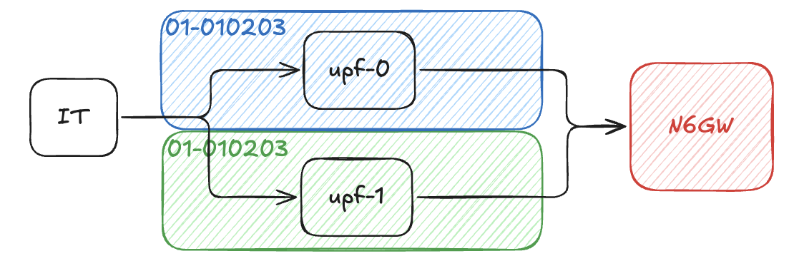
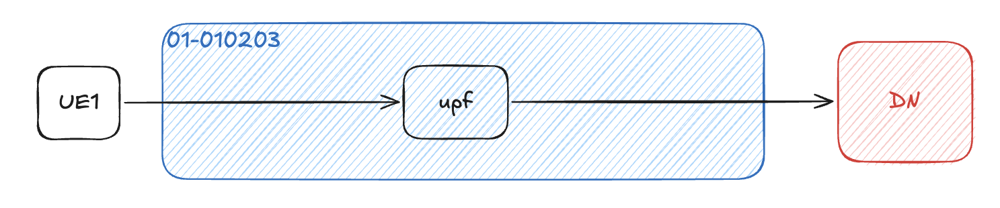
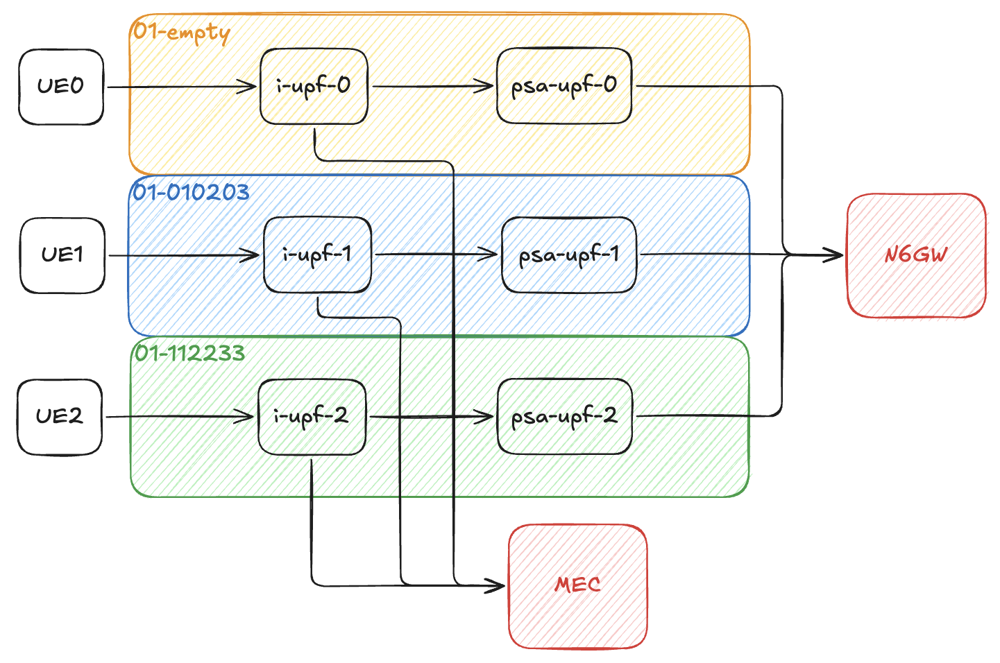

# ci-test

## Functional IT

IT means that the target function in free5GC will be test by go test code to ensure each step is worked as expected, like: registration / PDU session establishment.

- TestRegistration
- TestDeregistration
- TestGUTIRegistration
- TestEAPAKAPrimeAuthentication
- TestDuplicateRegistration
- TestServiceRequest
- TestPDUSessionReleaseRequest
- TestNasReroute
- TestN2Handover
- TestXnHandover
- TestPaging
- TestReSynchronization
- TestMultiAmfRegistration
- TestDC
- TestDynamicDC
- TestXnDcHandover
- TestRequestTwoPDUSessions
- TestNon3GPP
- TestTngf

- OAuth version

## E2E

E2E test will launch a simulate UE via [free-ran-ue](https://github.com/free-ran-ue). This will help to establish a UE network tunnel for testing data plane traffic to data network, like: `ping`.

### Basic

- [RegPduCharging](./doc/RegPduCharging.md)

### ULCL

- [Traffic Influence](./doc/ulcl-traffic-influence.md)
- [Multi-path](./doc/ulcl-multi-path.md)

## Test Workflow

1. Call `ci-test-xxx.sh` at root path.
2. The test directory will be mounted to the test container. The script called at first step will execute the test case in the container.
